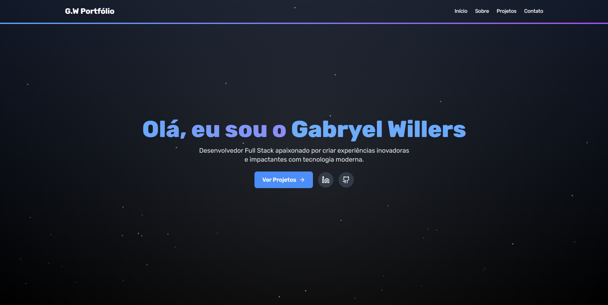
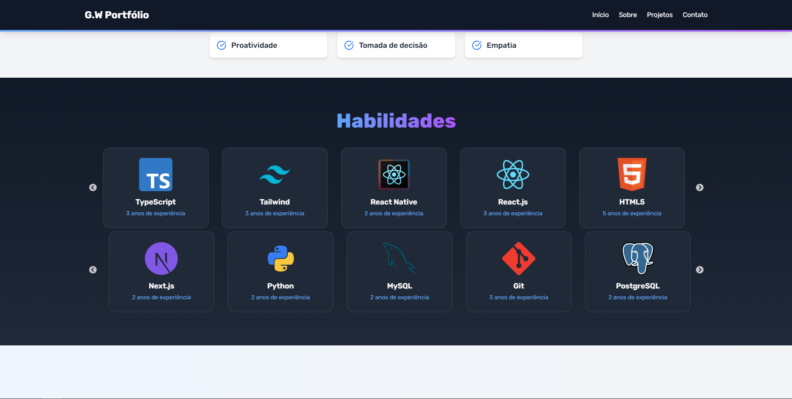

# 🚀 Gabryel Willers - Portfolio

Welcome to my personal portfolio repository! This project showcases my skills, experience, and projects in software development.

## 🌟 About Me
I am a passionate software developer with experience in front-end and full-stack development. This portfolio highlights my journey, skills, and the projects I've worked on.

## 📌 Features
- **About Me**: A brief introduction, including my education and professional experience.
- **Skills**: A list of my technical and soft skills.
- **Timeline**: My journey and growth in software development.
- **Projects**: Featured projects with descriptions, technologies used, and links.
- **Contact**: Ways to get in touch with me.

## 🛠️ Technologies Used
- **Front-End**: Next.js, React, TypeScript, Tailwind CSS, Framer Motion
- **Styling**: CSS, Tailwind CSS

## 🚀 Installation & Setup
To run this project locally, follow these steps:

```bash
# Clone the repository
git clone https://github.com/Gabryel-w/Gabryel_Portfolio.git

# Navigate to the project folder
cd Gabryel_Portfolio

# Install dependencies
npm install

# Start the development server
npm run dev
```

## 🌍 Live Demo
Check out the live version of my portfolio:  
🔗 [gabryelwillers.com.br](https://gabryelwillers.com.br)

## 📸 Screenshots
Here are some previews of my portfolio:

  
  

## 👨‍💻 Author
Developed by [Gabryel Willers](https://github.com/Gabryel-w). Let's connect and build something amazing!

---

Feel free to reach out for collaboration or any opportunities! 🚀